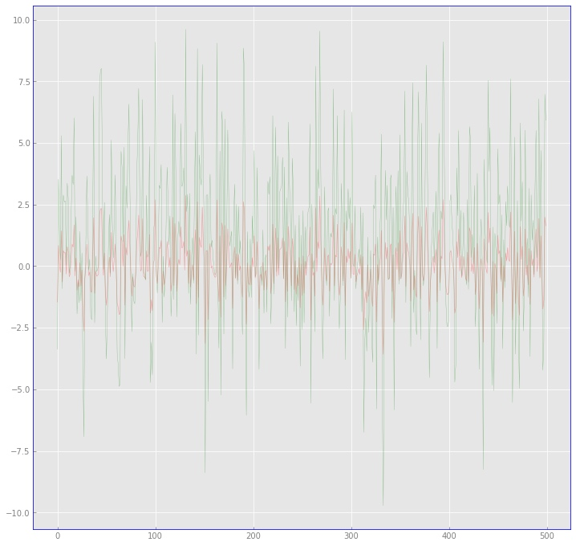
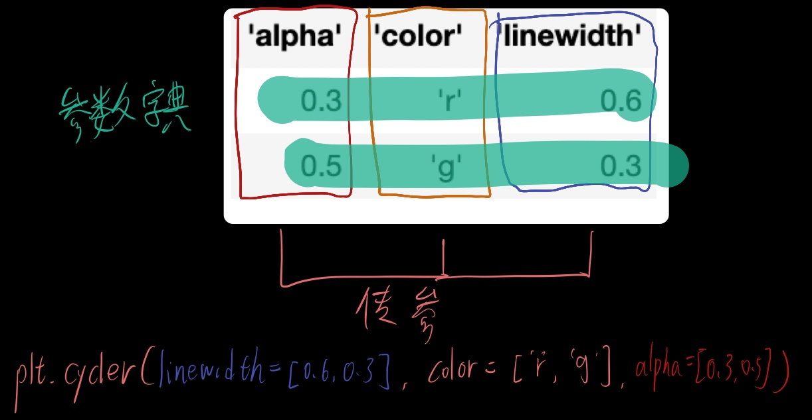
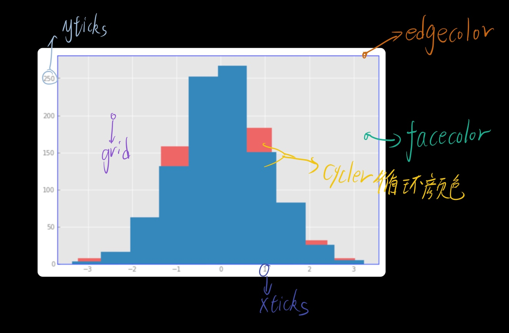

```python
# 导入模块
import pandas as pd
import numpy as numpy
import matplotlib.pyplot as plt
import os
# import seaborn as sns
import logging
from tqdm import tqdm
import warnings 
warnings.filterwarnings('ignore')
%matplotlib inline
plt.rc('font',family='SimHei', size=13)
# os.chdir('')
```
`matplotlib`默认的绘图图案是比较单调的，而且也并不是符合每个人的需要，因此，在正式绘图之前先把自己常用的默认参数都设置好十分之有必要，一般可以用`plt.rc()`或者`mpl.rcparams[key]`字典设置，个人认为只需要记住其中之一种设置方法即可。
通常使用`plt.style.use('ggplot)`即有较好的配色。

# cycler
`cycler`可以在循环绘图的时候打包一些参数设置，循环传入。

```python
# 造一些数据
data1=numpy.random.randn(500)
data2=data1*3+1
cycler=plt.cycler(linewidth=[0.6, 0.3], color=['r', 'g'], alpha=[0.3, 0.5])
fig,ax=plt.subplots()
for data, cyl in zip([data1,data2], cycler):
    ax.plot(data, **cyl)
```


```python
cycler
```

可以看到，`cycler`对象相当于是多个列表组成的字典，字典的键就是plot的参数名，后面拆包，依次传入。cycler可以认为是一个每行都是一个参数字典的列表。

# 设置默认参数
```python
from matplotlib import cycler
# 设置cycler，可以设置不同的颜色循环
colors = plt.cycler(color=
                ['red', 'blue', '#9988DD',
                 '#EECC55', '#88BB44', '#FFBBBB'])
# 设置子图样式
plt.rc('axes', facecolor='#E6E6E6', edgecolor='b',
       axisbelow=True, grid=True, prop_cycle=colors)
# 设置网格
plt.rc('grid', color='w', linestyle='solid')
# plt.rc('patch', edgecolor='#E6E6E6')
# 调整x轴标签样式
plt.rc('xtick', direction='in', color='gray')
plt.rc('ytick', direction='in', color='gray')
plt.rc('lines', linewidth=2, markeredgewidth=10,markeredgecolor='b')
# plt.rc('lines.markersize', edgecolor='b')

plt.rc('figure', figsize=(12, 12))# 设置整个图的大小
fig, ax=plt.subplots(figsize=(12,12))
x=numpy.random.randn(1000)
y=numpy.random.randn(1000)
ax.hist(x)
ax.hist(y)
# ax.scatter(x,y)
ax.set_title('super')
```


我认为比较有意思的是设置`cycler`的循环颜色，相当于整理好一套预设的配色方案，直接默认调用；另外还有值得设置的是`axes`的样式，`figure`的默认大小，`savefig`的默认dpi。