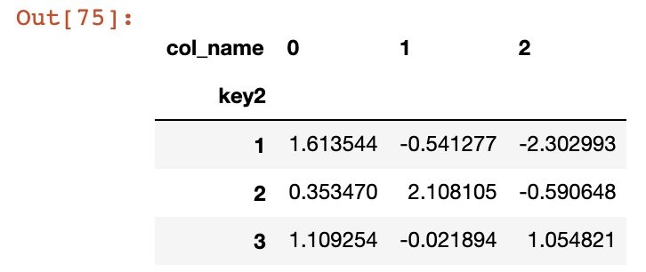
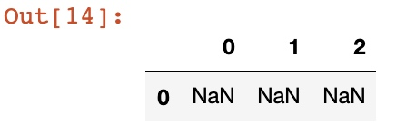

```python
import numpy as numpy
import pandas as pd
pd.options.display.max_rows = 20
numpy.random.seed(12345)
import matplotlib.pyplot as plt
plt.rc('figure', figsize=(10, 6))
numpy.set_printoptions(precision=4, suppress=True)
```
在数据分析中，总是需要进行各种各样的数据清洗和转换，如果能用好pandas本身内置的方法和技巧，使用起来事半功倍。
# 分层索引
## 创建分层索引的方式
创建一个分层索引最简单的方式就是在创建`dataframe`的时候在`index`参数里面传入一个层叠列表，这样就会产生多层索引。
比如下面

```python
df=pd.DataFrame(numpy.random.randn(18).reshape(6,3),index=[['a', 'b', 'a', 'b', 'c', 'c'], [1,2,3]*2])
df
```

## 多层索引的方式
一般来说pandas可以用两种索引方式：**位置索引**和**名字索引**，对应的就是`iloc`和`loc`，不管是前者还是后者，都只接受两个参数`[行对应的信息, 列对应的信息]`。如果是多层索引的话，就是要传入一个元组列表去索引。
```python
df.loc[[('a', 1), ('a', 3), ('b', 1)],0]
```

查看索引方式

```python
df.index
```

我们可以对索引进行重新命名和指定按照哪一层级进行排序。
## 按照层级进行排序，加和
我们可以在一些统计方法比如`sum`和`sort_index`传入`level`的参数，可以是名字也可以是数字。

```python
df.sum(level=0)
```

```python
df.sum(level=1)
```

排序

```python
df.sort_index(level='key1')
```


# 数据清洗与准备
## 缺失值
处理方法


在判断某一行是否具有缺失值的时候注意可以结合`any`和`sum`方法进行联合判断出所有都是缺失值或者存在缺失值的行。类似的在`dropna`中可以传入`how`参数为`any`或者`all`来指定丢弃的方式。

```python
df.head()
```


```python
df[df.isnull().any(1)]
```


```python
df[df.isnull().all(1)]
```

## 重命名索引或者列标签名
使用`rename`方法，里面传入一个字典即可，字典里面既可以是值，也可以是对应的函数方法。

```python
data = pd.DataFrame(numpy.arange(12).reshape((3, 4)),
                    index=['Ohio', 'Colorado', 'New York'],
                    columns=['one', 'two', 'three', 'four'])
data.head()
```


我们在这里如果是对索引`['Ohio', 'Colorado', 'New York']`都进行小写化，而对应的列名`['one', 'two', 'three', 'four']`进行首字母大写化。我们可以这么实现：

```python
data.rename(index=lambda x:x.lower(), columns=str.upper)
```

如果不是要进行函数处理，而是对应去替换值，那就传入一个字典去替换。

```python
data.rename(index={'OHIO': 'INDIANA'},
            columns={'three': 'peekaboo'})
```

## 离散化和分箱
分箱有3个重要参数可以关注下。
|参数名|对应的功能|
|:---:|:---:|
|labels|对应分箱的名|
|precision|精确度|
|right/left|是否包括右边界和左边界|


```python
ages = [20, 22, 25, 27, 21, 23, 37, 31, 61, 45, 41, 32]
group_names = ['Youth', 'YoungAdult', 'MiddleAged', 'Senior']
pd.cut(ages, 4, labels=group_names, precision=2)
```

# 随机抽样
`numpy.random.permutation`可以在给定值下，在值范围内进行随机重排序。

```
df = pd.DataFrame(numpy.arange(5 * 4).reshape((5, 4)))
sampler = numpy.random.permutation(5)
sampler
```

dataframe的`take`方法筛选出对应索引的子集

```python
df
df.take(sampler)
```


`sample`方法则可以给定数字，随机抽取对应n个元素

```python
df.sample(3)
```

